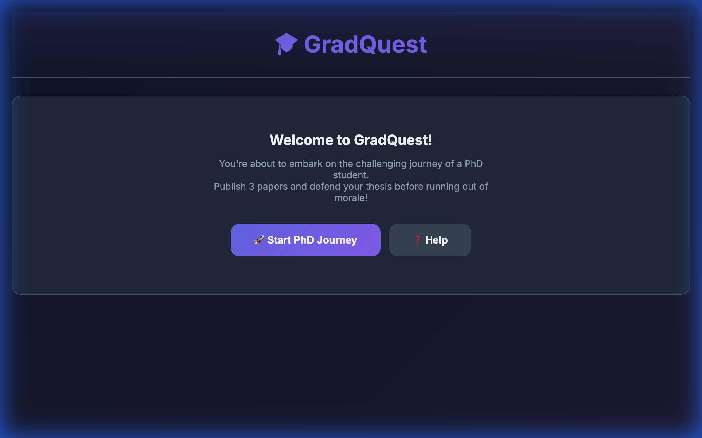
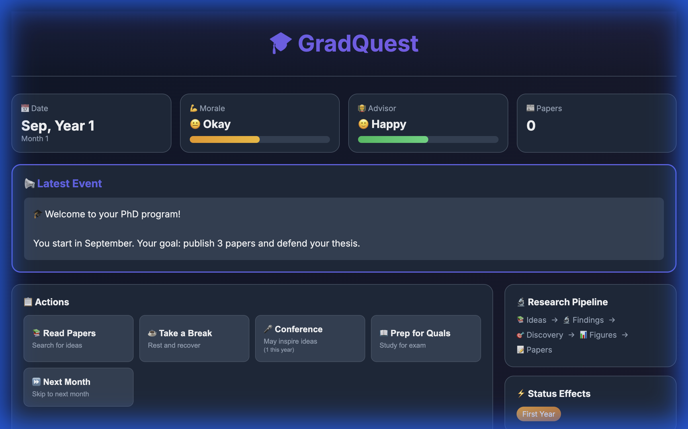

# 🎓 GradQuest: 用 Antigravity 打造一个 PhD 生存模拟游戏

## 项目概述

**GradQuest** 是一个 PhD 生存模拟游戏，灵感来自经典的 [PhD Simulator](http://research.wmz.ninja/projects/phd)。玩家需要在博士生涯中发表3篇论文并完成答辩，同时保持 morale 不归零。

🎮 **在线试玩**: https://xy-vince.github.io/GradQuest/
📦 **GitHub**: https://github.com/XY-Vince/GradQuest

---

## 游戏截图

### 开始界面


### 游戏界面


---

## 开发过程

### 起点：一个 Python 原型

最初我有一个用 Python 写的 PhD Simulator 移植版本，包含：
- 核心引擎 (VariableStore, EventEngine)
- CLI 界面
- YAML 配置的事件系统

但这个版本需要本地运行，不便分享。

### Day 1: 静态网页版本 (V1.6)

用 Antigravity 把整个游戏逻辑移植到纯 JavaScript：
- 单个 `index.html` 文件，可直接在 GitHub Pages 部署
- `localStorage` 存档/读档
- 响应式 UI，暗色主题

**关键对话**：
> "帮我创建一个静态 JavaScript 版本，可以部署到 GitHub Pages"

Antigravity 一次性生成了完整的 HTML/CSS/JS，包括渐变背景、卡片布局、进度条等。

### Day 2: 沉浸感升级 (V1.7 - V1.9)

基于实际游戏体验的反馈，逐步优化：

| 版本 | 改进 |
|------|------|
| V1.7 | 帮助按钮、种子分享 URL、成功时加 morale |
| V1.8 | 论文审稿延迟 (2-5 月)、多样化反馈文字 |
| V1.9 | 打字机效果、游戏内 Load 按钮、去掉数字提示 |

**典型迭代**：
```
我：会议的 morale 从 +8 改成 +2-4
AI：Done! ✅ 
[自动修改代码、git commit、push]
```

### Day 3: 专业化 (V2.0)

这是一次 major revision，目标是让项目看起来像一个正经的软件：

✅ **README 重写**：添加 badges、架构图、快速开始  
✅ **CONTRIBUTING.md**：贡献指南  
✅ **CHANGELOG.md**：版本历史  
✅ **GitHub Actions**：自动化测试  
✅ **Pipeline Visualizer**：可视化研究流程

```
📚 Ideas → 🔬 Findings → 🎯 Discovery → 📊 Figures → 📝 Papers
```

---

## 使用 Antigravity 的体会

### 🚀 优点

1. **快速迭代**：提 bug → 修复 → commit → push，一气呵成
2. **上下文保持**：跨多轮对话记住项目结构和之前的决策
3. **主动执行**：不只是给代码，直接帮你改文件、跑命令

### ⚠️ 需要注意

1. **明确需求**：越具体的指令，结果越好
2. **逐步验证**：大改动分成小步骤，每步测试
3. **保持控制**：复杂逻辑还是要自己 review

---

## 关键数据

| 指标 | 数据 |
|------|------|
| 开发时间 | ~3 天 (断断续续) |
| 代码量 | ~1100 行 HTML/JS (单文件) |
| 版本迭代 | V1.0 → V2.0.2 (12+ 次 push) |
| 工具调用 | ~1000+ 次 |

---

## 总结

GradQuest 是一个有趣的周末项目，通过 Antigravity 从原型到可分享的网页游戏只用了几天。AI 特别擅长处理：
- 重复性的 UI 调整
- 跨文件的重构
- 自动化的 commit/push 流程

如果你也有类似的小项目想法，不妨试试！

---

**欢迎试玩并反馈**：https://xy-vince.github.io/GradQuest/ 🎓
