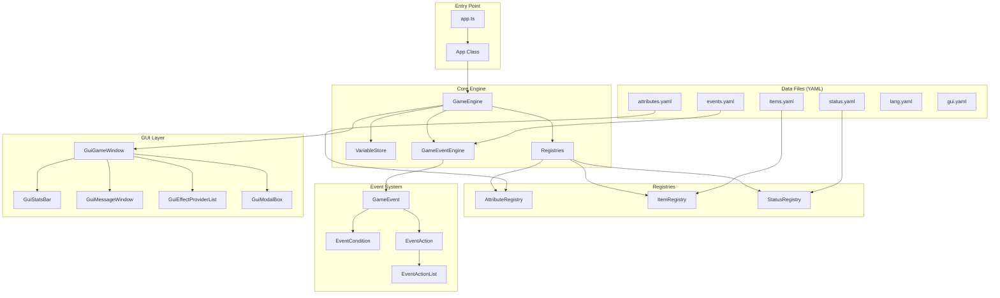
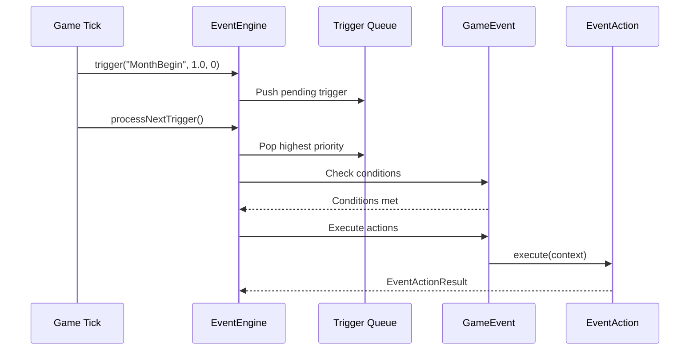
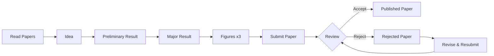

# PhD Simulator - Project Overview

A random event-driven, text-based game that simulates the life of a PhD student. Built with TypeScript and bundled with Webpack.

**Play Online**: [https://research.wmz.ninja/projects/phd/index.html](https://research.wmz.ninja/projects/phd/index.html)

---

## Table of Contents
1. [Project Architecture](#project-architecture)
2. [Directory Structure](#directory-structure)
3. [Core Systems](#core-systems)
4. [Game Mechanics](#game-mechanics)
5. [Data-Driven Design](#data-driven-design)
6. [Build & Development](#build--development)
7. [Key Classes Reference](#key-classes-reference)

---

## Project Architecture



---

## Directory Structure

```
phd-game/
├── src/                        # TypeScript source code
│   ├── app.ts                  # Application entry point
│   ├── gameEngine.ts           # Central game controller
│   ├── variableStore.ts        # Game state variable management
│   ├── endGameState.ts         # End game state definitions
│   │
│   ├── effect/                 # Effect system (modifiers)
│   │   ├── attribute.ts        # Player/game attribute system
│   │   ├── effect.ts           # Base effect handling
│   │   ├── item.ts             # Item definitions and inventory
│   │   └── status.ts           # Status effects (buffs/debuffs)
│   │
│   ├── event/                  # Event-driven game logic
│   │   ├── core.ts             # Core event interfaces & classes
│   │   ├── engine.ts           # GameEventEngine - trigger processing
│   │   ├── actions.ts          # EventAction implementations (47KB+)
│   │   ├── conditions.ts       # EventCondition implementations
│   │   ├── expression.ts       # Expression evaluation system
│   │   ├── loader.ts           # YAML event loading
│   │   └── translationKeySource.ts  # i18n key extraction
│   │
│   ├── gui/                    # User interface components
│   │   ├── guiGame.ts          # Main game window
│   │   ├── guiBase.ts          # Base GUI class
│   │   ├── guiMessageWindow.ts # Message display panel
│   │   ├── guiModalBox.ts      # Modal dialogs
│   │   ├── guiStatsBar.ts      # Stats/progress bar
│   │   ├── guiEffectProviderList.ts  # Items/Status display
│   │   ├── guiFx.ts            # Visual effects (confetti, etc.)
│   │   ├── guiFooter.ts        # Footer component
│   │   └── textEngine.ts       # Text rendering with variables
│   │
│   ├── i18n/                   # Internationalization
│   │   └── localization.ts     # Translation dictionary
│   │
│   └── utils/                  # Utility modules
│       ├── collection.ts       # Collection helpers
│       ├── expression.ts       # Expression parser
│       ├── json.ts             # JSON type helpers
│       ├── network.ts          # Async file loading
│       ├── priorityQueue.ts    # Priority queue for events
│       ├── random.ts           # Seeded random number generator
│       └── simpleRegistry.ts   # Generic registry pattern
│
├── static/                     # Static assets (served directly)
│   ├── index.html              # Main HTML entry
│   ├── css/
│   │   ├── main.css            # Game styles
│   │   ├── PressStart2P-Regular.ttf  # Pixel font
│   │   └── PressStart2P-License.txt
│   ├── images/                 # Game images
│   └── rulesets/
│       └── default/            # Default game ruleset
│           ├── events.yaml     # Event definitions (28KB+)
│           ├── items.yaml      # Item definitions
│           ├── status.yaml     # Status effect definitions
│           ├── attributes.yaml # Player attribute definitions
│           ├── lang.yaml       # Localization strings (20KB+)
│           └── gui.yaml        # GUI configuration
│
├── app.js                      # Express server entry point
├── package.json                # NPM dependencies
├── tsconfig.json               # TypeScript configuration
├── webpack.config.js           # Webpack bundler configuration
├── README.md                   # Basic readme
└── LICENSE                     # MIT License
```

---

## Core Systems

### 1. Game Engine (`gameEngine.ts`)

The `GameEngine` class is the central controller that orchestrates all game systems:

| Responsibility | Description |
|----------------|-------------|
| **Game State** | Manages `VariableStore` for all game variables |
| **Registries** | Holds `AttributeRegistry`, `ItemRegistry`, `StatusRegistry` |
| **Event Processing** | Controls `GameEventEngine` for trigger-based events |
| **Game Loop** | `tick()` method advances game time (called every 50ms) |
| **Lifecycle** | `start()`, `loadGameData()`, and game end handling |

### 2. Variable Store (`variableStore.ts`)

Centralized numeric variable storage with features:
- **Variable Limits**: Clamp values with `setVarLimits(name, min, max)`
- **Change Events**: Observable variable changes via `onVariableChanged` handler
- **Serialization**: JSON encode/decode for save/load (handles `Infinity`, `NaN`)

**Key Variables in the Game:**
| Variable | Description |
|----------|-------------|
| `player.hope` | Player morale (0-100, game over at 0) |
| `elapsedMonth` | Total months since game start |
| `month` / `year` | Current in-game date |
| `player.readPapers` | Papers read (affects success rates) |
| `advisor.happiness` | Advisor satisfaction level |
| `rule.papersRequired` | Papers needed to graduate (default: 3) |

### 3. Event System (`event/`)

The heart of the game's logic - a declarative event processing system:



**Event Processing Flow:**
1. `trigger(triggerId, probability, priority)` - Queue a trigger
2. `processNextTrigger(context)` - Process queued triggers
3. For each event matching the trigger:
   - Check if disabled
   - Check exclusion list
   - Evaluate all conditions
   - Apply probability check
   - Execute action list
   - Handle `once` flag (disable after first execution)

### 4. Effect System (`effect/`)

Three-tiered effect system for modifying game state:

| Component | Purpose |
|-----------|---------|
| **Attributes** | Base values that can be modified (e.g., `player.experimentBoost`) |
| **Items** | Countable inventory items with rarity (e.g., `idea`, `paper`) |
| **Status** | Temporary or permanent buffs/debuffs with attribute modifiers |

**Status Duration System:**
- Numeric duration in months (e.g., `duration: 12`)
- `Infinity` for permanent status effects
- Status effects apply attribute modifiers while active

### 5. GUI System (`gui/`)

Component-based UI architecture:

| Component | Purpose |
|-----------|---------|
| `GuiGameWindow` | Main container, renders all child components |
| `GuiStatsBar` | Displays year/month and hope meter |
| `GuiMessageWindow` | Shows current event message |
| `GuiModalBox` | Modal dialogs for choices |
| `GuiEffectProviderList` | Items and status effect display |
| `TextEngine` | Variable interpolation in displayed text |

---

## Game Mechanics

### Win/Lose Conditions

| Condition | Outcome |
|-----------|---------|
| Publish 3 papers + Work on thesis | **WIN** - Graduation 🎉 |
| Decline PhD offer at start | **WIN** - Alternative ending |
| Hope reaches 0 | **LOSE** - Lost all hope |
| Year 8+ reached | **LOSE** - Overdue |
| Fail qualifying exam | **LOSE** - Failed quals |

### Research Pipeline



### Monthly Actions

| Action | Requirements | Effects |
|--------|--------------|---------|
| Read Papers | < 3 papers | Chance to gain Idea, +exhaustion |
| Work on Idea | Has Idea | Chance for Preliminary Result |
| Work on Preliminary | Has Prelim | Chance for Major Result |
| Work on Figures | Has Major, no broken equipment | Chance for Figures |
| Work on Paper | Major + 3 Figures | Chance to submit paper |
| Revise Paper | Has Rejected Paper | Resubmit paper |
| Prepare for Quals | Year 1, < December | +1 Qualify Level |
| Slack Off | Any time | Chance to recover hope, risk advisor anger |

### Status Effects

| Status | Duration | Effect |
|--------|----------|--------|
| `firstYear` | 12 months | +1 hope boost/month |
| `exhaustion` | Permanent | -5 hope boost/month |
| `unhappyAdvisor` | Permanent | -5 hope boost/month |
| `lateYearAnxiety` | Permanent | -1 hope boost/month (Year 4+) |
| `brokenEquipment` | 1 month | Blocks figure work |
| `upgradedEquipment` | Permanent | +0.3 experiment boost |
| `cloudStorage` | Permanent | Protects against data loss |

---

## Data-Driven Design

The game is highly moddable through YAML configuration files:

### Event Definition Schema (`events.yaml`)

```yaml
- id: EventName              # Unique identifier
  trigger: TriggerName       # When to check this event
  once: true                 # Optional: only fire once
  probability: 0.5           # Optional: chance to execute (0-1)
  conditions:                # Optional: all must be true
    - id: Expression
      expression: year >= 2 && player.hope > 10
  exclusions:                # Optional: events blocked after this fires
    - OtherEventId
  actions:                   # Actions to execute
    - id: DisplayMessage
      message: message.key
      confirm: message.ok
    - id: UpdateVariable
      variable: player.hope
      value: player.hope + 10
```

### Available Action Types

| Action ID | Purpose |
|-----------|---------|
| `DisplayMessage` | Show a message with confirm button |
| `DisplayChoices` | Show multiple choice options |
| `DisplayRandomMessage` | Random message from list |
| `UpdateVariable` | Modify a single variable |
| `UpdateVariables` | Modify multiple variables |
| `GiveItem` | Add/remove inventory item |
| `SetStatus` | Toggle status effect |
| `TriggerEvents` | Queue another trigger |
| `Switch` | Conditional branching |
| `CoinFlip` | Probability-based branching |
| `Random` | Weighted random branching |
| `EndGame` | End the game (win/lose) |
| `EnableEvent` / `DisableEvent` | Control event availability |

### Expression System

Expressions are evaluated in conditions and variable updates:

```yaml
# Operators: + - * / % && || ! < > <= >= === !==
# Functions: min(), max(), floor(), randi(), clip()
# Game queries: itemCount(), hasStatus(), eventOccurred(), getAttributeValue()

expression: player.hope + 10        # Arithmetic
expression: year >= 2 && month === 1  # Logical
expression: itemCount('paper') >= 3   # Game state
expression: hasStatus('exhaustion')   # Status check
expression: randi(5) + 5              # Random integer [0, 5) + 5
```

---

## Build & Development

### Prerequisites
- Node.js (v16+)
- npm

### Commands

```bash
# Install dependencies
npm install

# Build production bundle
npm run build

# Start development server (port 8000)
npm start

# Full build and serve
npm run build && npm start
```

### Build Output
- Bundles TypeScript to `dist/app.bundle.js`
- Copies static files to `dist/`
- Uses terser for minification

### Tech Stack

| Technology | Purpose |
|------------|---------|
| TypeScript 5.2 | Type-safe JavaScript |
| Webpack 5 | Module bundler |
| js-yaml | YAML parsing |
| seedrandom | Seeded PRNG |
| query-string | URL hash parsing |
| express | Local development server |

---

## Key Classes Reference

### GameEngine
```typescript
class GameEngine {
  variableStore: VariableStore;
  attributeRegistry: AttributeRegistry;
  itemRegistry: ItemRegistry;
  statusRegistry: StatusRegistry;
  eventEngine: GameEventEngine;
  
  loadGameData(): Promise<void>;
  start(newRandomSeed: boolean): Promise<void>;
  tick(): Promise<void>;
}
```

### GameEventEngine
```typescript
class GameEventEngine {
  registerEvent(e: GameEvent): void;
  enableEvent(eventId: string): void;
  disableEvent(eventId: string): void;
  trigger(triggerId: string, probability: number, priority: number): void;
  processNextTrigger(context: EventActionExecutionContext): Promise<boolean>;
  reset(): void;
}
```

### VariableStore
```typescript
class VariableStore {
  setVar(varName: string, value: number): void;
  getVar(varName: string, checkExistence?: boolean): number | undefined;
  setVarLimits(varName: string, min: number, max: number): void;
  reset(): void;
  encodeAsJson(): JsonValue;
  decodeFromJson(json: JsonValue): void;
}
```

---

## License

MIT License
